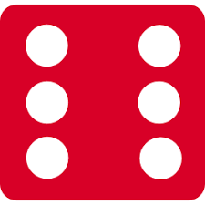

# dice-challenge
<!DOCTYPE html>
<html lang="en" dir="ltr">
  <head>
    <meta charset="utf-8">
    <title>Dicee</title>
    <link rel="stylesheet" href="styles.css">
    <link href="https://fonts.googleapis.com/css?family=Indie+Flower|Lobster" rel="stylesheet">

  </head>
  <body>

    

      <h1 id="=title">Refresh Me</h1>

      

        
Player 1

        
        
      

      

        
Player 2

        
        
        
        
      

       
      <Button> click me</Button>
      

    

    

  </body>

  <footer>
    www 🎲 App luck 🎲 com
  </footer>
</html>

#java script
var n;
var n1;
document.querySelector("button").addEventListener("click",dice);
function dice() {
    player1();
    player2();
    if (n > n1) {
        document.querySelector("h1").innerHTML = "Player 1 winner";

    }
    else if(n<n1){
        document.querySelector("h1").innerHTML = "Player 2 winner";
    }
    else{
        document.querySelector("h1").innerHTML = "game draw";
    }

}
function player1(){

     n = Math.random();
    n=n*6;
    n= Math.floor(n)+1;
    
    if(n===1){
        document.querySelector(".img1").setAttribute("src", " images.png")
    }
    else if(n==2){
        document.querySelector(".img1").setAttribute("src","images (1).png");
    }
    else if(n==3){
        document.querySelector(".img1").setAttribute("src","download (1).png");
    }
    else if(n==4){
        document.querySelector(".img1").setAttribute("src","download (2).png");
    }
    else if(n==5){
        document.querySelector(".img1").setAttribute("src","images (2).png");
    }
    else{
        document.querySelector(".img1").setAttribute("src","download.png");
    }   
}
 
    function player2() {
     n1 = Math.random();
    n1=n1*6;
    n1= Math.floor(n1)+1;
    if(n1===1){
        document.querySelector(".img2").setAttribute("src"," images.png")
    }
    else if(n1==2){
        document.querySelector(".img2").setAttribute("src","images (1).png");
    }
    else if(n1==3){
        document.querySelector(".img2").setAttribute("src","download (1).png");
    }
    else if(n1==4){
        document.querySelector(".img2").setAttribute("src","download (2).png");
    }
    else if(n1==5){
        document.querySelector(".img2").setAttribute("src","images (2).png");
    }
    else{
        document.querySelector(".img2").setAttribute("src","download.png");
    }   
    
}
#css file
.container {
  width: 70%;
  margin: auto;
  text-align: center;
}

.dice {
  text-align: center;
  display: inline-block;

}

body {
  background-color: #393E46;
}

h1 {
  margin: 30px;
  font-family: 'Lobster', cursive;
  text-shadow: 5px 0 #232931;
  font-size: 8rem;
  color: #4ECCA3;
}

p {
  font-size: 2rem;
  color: #4ECCA3;
  font-family: 'Indie Flower', cursive;
}

img {
  width: 50%;
}

footer {
  margin-top: 5%;
  color: #EEEEEE;
  text-align: center;
  font-family: 'Indie Flower', cursive;

}
button{
  margin: 30px;
  color: red;
  justify-content: center;
  font-size: 2rem;
  border: 1px;
  border-radius: 10px;
  background-color: #4ECCA3;
  
}
